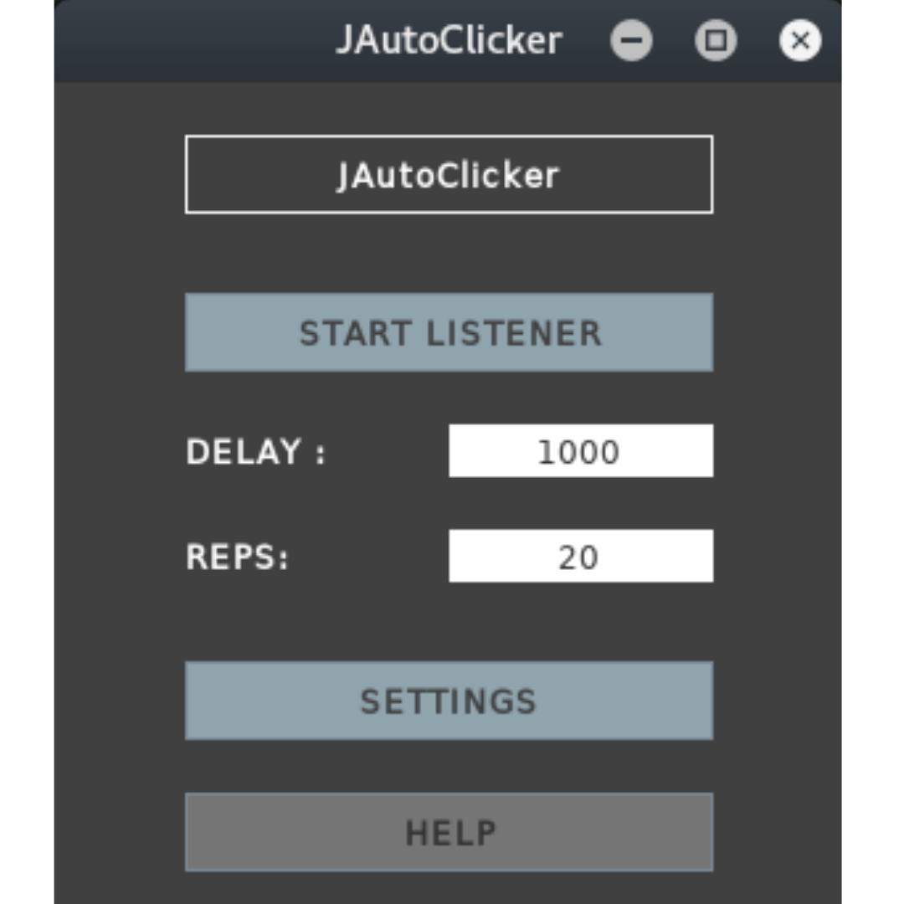

# JAutoClicker
JAutoClicker is a Simple JAVA based GUI Auto Clicker Application. JAutoClicker allows user to select different coordinates with desired delay and repetations of the process.



## How to Use
-> Run the JAR File  
    <b>OR</b>  
-> Run From Terminal/Cmd:- `$ java -jar JAutoClicker.jar`  
    <b>OR</b>  
-> From Terminal/Cmd(with Compiling):-  
```
$ cd src
$ javac JAutoClicker.java
$ java JAutoClicker
```  
